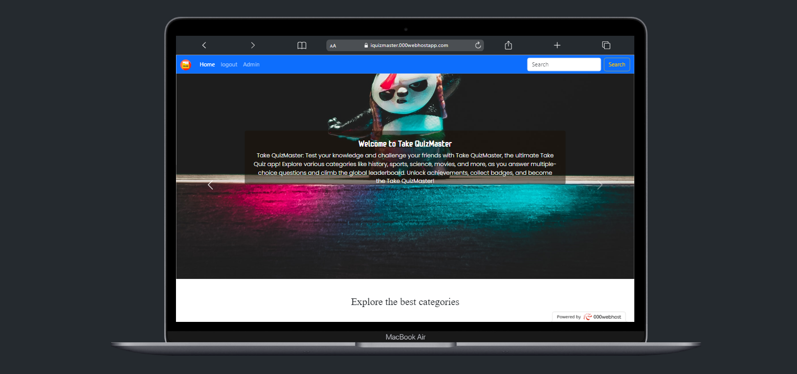

# Quiz Application (PHP-based)

## Overview

Welcome to the Quiz Application! This project allows users to take quizzes on various topics and test their knowledge. The application is built using PHP, providing an interactive and engaging way for users to learn and challenge themselves.

## Features

1. **User Registration and Login**: Users can create accounts, log in, and access personalized features.

2. **Quiz Categories**: Quizzes are organized into different categories, making it easy for users to choose their preferred topics.

3. **Quiz Taking**: Users can attempt quizzes, answer questions, and receive instant feedback on their performance.

4. **Admin Panel**: Admins have access to manage quizzes, add new questions, create new categories, and review user performance.

